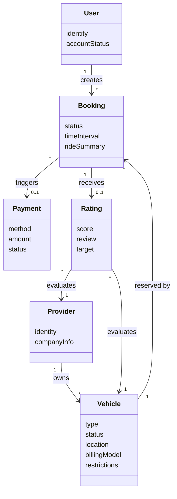
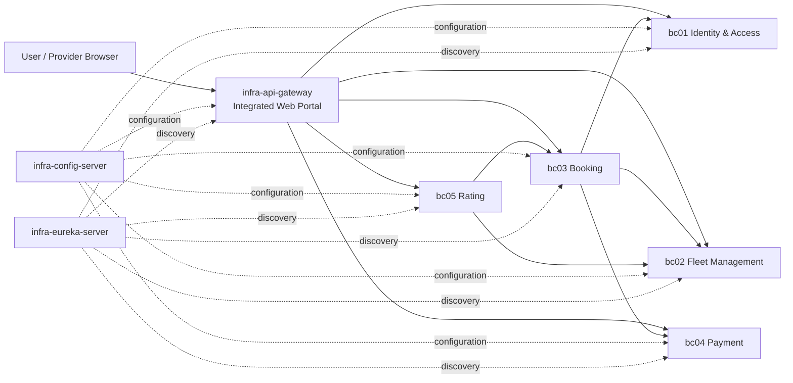

# Instant Mobility Platform

## Summary

Instant Mobility Platform is a shared-mobility application scenario for renting vehicles such as bicycles, e-bikes, e-scooters, and e-cars from independent providers. The system supports the complete customer journey from registration and vehicle search through booking, ride completion, payment, and rating, while providers manage their fleets, pricing, restrictions, ratings, and earnings. The domain is decomposed into five DDD bounded contexts and implemented as Spring Boot microservices with supporting infrastructure for service discovery, centralized configuration, and an integrated web portal.

Patterns and technologies used:

- Domain-Driven Design: domain model, bounded contexts, context mapping, tactical design, aggregates, value objects, repositories, services, and domain events.
- Architecture patterns: microservices, Open Host Service / Published Language, Anti-Corruption Layer, Customer/Supplier, Conformist, API gateway, service discovery, centralized configuration, and circuit breaker with fallback.
- Implementation technologies: Java 17, Spring Boot 3, Spring Cloud Eureka, Spring Cloud Config, Spring Cloud OpenFeign, Resilience4j, Spring Data JPA, H2, Thymeleaf, Springdoc OpenAPI, Maven, and LEMMA models.

## Functionality

### Functional Requirements

The implemented functionality follows the requirements analysis from Lab Assignment 02, Task 2.1. The application covers both the user side and the provider side of the instant-mobility scenario.

| ID | Requirement | Implemented behavior |
|---|---|---|
| R01 | User registration | Customers can create user accounts with personal and login data. |
| R02 | User login | Registered users can authenticate and access the customer dashboard. |
| R03 | Provider registration | Fleet providers can register provider accounts with company data. |
| R04 | Provider login | Providers can authenticate and access provider-specific fleet views. |
| R05 | Vehicle management | Providers can create, edit, delete, and inspect vehicles in their fleet. |
| R06 | Pricing management | Providers define a billing model and price information for vehicles. |
| R07 | Usage restrictions | Providers define restrictions such as age or usage limitations for vehicles. |
| R08 | Fleet status tracking | Vehicle status and location can be tracked and updated. |
| R09 | Vehicle search | Users can search available vehicles by location and availability criteria. |
| R10 | Vehicle filtering | Users can compare vehicles by type, billing model, price, and restrictions. |
| R11 | Booking creation | Users can create a booking for an available vehicle. |
| R12 | Ride completion | Users can end a ride; the booking service calculates the ride summary and cost. |
| R13 | Payment processing | Completed bookings trigger payment creation and status handling. |
| R14 | Rating submission | Users can rate completed bookings, vehicles, and providers. |
| R15 | History and reporting | Users can inspect booking/payment/rating history, while providers can view ratings and earnings. |

The integrated Task 2 system exposes the full "search -> book -> ride -> pay -> rate" workflow through the combined web portal in `Assignment05/Task2/infra-api-gateway`.

### Description of the Domain Concepts (Domain Model)

The original domain model identifies six core business concepts: `User`, `Provider`, `Vehicle`, `Booking`, `Payment`, and `Rating`. These concepts are refined into five bounded contexts so that each service owns only the model needed for its business responsibility.

The tactical DDD model is organized as follows:

| Bounded context | Main responsibility | Core domain concepts |
|---|---|---|
| BC-01 Identity & Access | Account management and authentication for users and providers. | `UserAccount`, `ProviderAccount`, `PersonalInfo`, `CompanyInfo`, `AuthToken`, `AuthenticationService`, `RegistrationService`. |
| BC-02 Fleet Management | Vehicle lifecycle, provider fleet ownership, pricing, restrictions, location, and status. | `Vehicle` aggregate, `VehicleLocation`, `PricingPolicy`, `UsageRestrictions`, `VehicleType`, `VehicleStatus`, `BillingModel`, `VehicleRegistrationService`, `FleetStatusService`. |
| BC-03 Booking | Search, booking lifecycle, ride completion, restriction checks, and cost calculation. | `Booking` aggregate, `BookingStatus`, `RideLocation`, `TimeInterval`, `VehicleSnapshot`, `RideSummary`, `BookingService`, `RestrictionValidator`, `CostCalculationService`. |
| BC-04 Payment | Payment creation and transaction status for completed rides. | `Payment` aggregate, `PaymentMethod`, `PaymentStatus`, payment processing service, gateway adapter. |
| BC-05 Rating | Post-ride feedback for vehicles and providers. | `Rating` aggregate, `Score`, `Review`, `RatingTarget`, `RatingSubmissionService`, `RatingQueryService`. |

Important domain invariants include:

- A vehicle can only be booked when it is available and the user satisfies its usage restrictions.
- A booking progresses through an explicit lifecycle such as active, completed, or cancelled.
- Payment is connected to a completed ride and records whether the charge succeeded or failed.
- A rating can only be submitted for a completed booking.
- A booking can receive at most one rating.
- Rating scores are constrained to the valid 1 to 5 range.

## Architecture Design

The architecture follows the bounded-context split from Assignment 03 and maps each bounded context to one deployable microservice in Assignment 05. Infrastructure services provide discovery, externalized configuration, and a user-facing portal.

Context relationships use the language from Vernon's context mapping:

- Identity & Access is a global upstream context. Other services use its published API for authentication and account references.
- Fleet Management is upstream to Booking and Rating for vehicle and provider data.
- Booking is the central operational context. It consumes Identity and Fleet data, owns the ride lifecycle, and supplies booking state to Payment and Rating.
- Payment consumes booking/payment requests and owns transaction state.
- Rating consumes completed booking and fleet information to validate and store feedback.

The main architectural decisions are:

- Each bounded context is implemented as an independently runnable Spring Boot service with its own REST API, web UI, persistence model, and H2 database.
- Cross-context communication is synchronous HTTP through OpenFeign clients where service integration is required.
- Eureka decouples services from fixed hostnames by providing service discovery.
- Spring Cloud Config keeps service configuration in the shared `Assignment05/Task2/config` directory.
- Resilience4j circuit breakers protect outbound calls in services with dependencies: Booking, Payment, and Rating. Fallbacks use the same mock clients from the standalone Task 1 implementation so services can still run when a dependency is unavailable.
- The API gateway provides the integrated browser workflow and composes data from multiple services for dashboards, provider earnings, and rating views.

## Implementation

### Technologies

| Technology | Purpose in the solution |
|---|---|
| Java 17 | Main programming language for the services and domain logic. |
| Spring Boot 3.2.5 | Base framework for REST APIs, web controllers, dependency injection, validation, and application bootstrapping. |
| Spring Web MVC | Implements REST endpoints and server-rendered web routes. |
| Spring Data JPA | Provides repository abstractions and persistence for each bounded context. |
| H2 Database | Lightweight per-service database used for local development and assignment delivery. |
| Thymeleaf | Server-side HTML templates for service UIs and the integrated portal. |
| Spring Cloud Eureka | Service registry used by the services and gateway for discovery. |
| Spring Cloud Config | Centralized configuration server backed by the repository's config files. |
| Spring Cloud OpenFeign | Declarative HTTP clients for synchronous cross-service calls. |
| Spring Cloud LoadBalancer | Client-side load balancing for discovered services. |
| Resilience4j | Circuit breaker implementation for outbound dependencies and gateway adapters. |
| Spring Boot Actuator | Runtime health and circuit-breaker inspection endpoints. |
| Springdoc OpenAPI | Swagger/OpenAPI documentation for service APIs. |
| Maven | Multi-module build for infrastructure services and bounded-context services. |
| LEMMA | Architecture and technology modeling artifacts for service, operation, mapping, and data models. |

### Solution Architecture

The final integrated implementation is located in `Assignment05/Task2`. It is a Maven multi-module system with the following modules:

| Module | Port | Responsibility |
|---|---:|---|
| `infra-eureka-server` | 8761 | Service discovery registry. |
| `infra-config-server` | 8888 | Central configuration server for all services. |
| `infra-api-gateway` | 8080 | Combined web portal and orchestration layer for browser workflows. |
| `bc01-identity-access` | 8081 | User/provider registration, login, account data, and token validation. |
| `bc02-fleet-management` | 8082 | Vehicle CRUD, search, status, location, pricing, and restrictions. |
| `bc03-booking` | 8083 | Booking creation, active ride handling, completion, cost calculation, and payment triggering. |
| `bc04-payment` | 8084 | Payment records, payment method handling, and transaction status. |
| `bc05-rating` | 8085 | Rating submission, rating lookup, average scores, and target validation. |

The implementation keeps the DDD layers explicit inside the bounded-context services:

- API/UI layer: REST controllers, DTOs, web controllers, and Thymeleaf views.
- Application layer: use-case services that coordinate domain behavior and infrastructure clients.
- Domain layer: aggregates, entities, value objects, domain services, enums, and business rules.
- Infrastructure layer: Spring Data repositories, Feign clients, gateway adapters, fallback clients, seed data, and configuration.

The service integration in Task 2 extends the standalone Task 1 services. Task 1 uses mock clients for cross-context data. Task 2 wraps those clients with real Feign-based clients and Resilience4j fallbacks so the system can run as one integrated platform while still tolerating unavailable services during local development.

Supporting documentation and models:

- `Assignment02`: requirements analysis and initial domain model.
- `Assignment03`: bounded contexts and context map.
- `Assignment04`: tactical DDD design and event-storming documentation.
- `Assignment05/Task1`: standalone microservice implementation.
- `Assignment05/Task2`: integrated microservice implementation.
- `Lemma`: LEMMA data, service, operation, mapping, and technology models.
